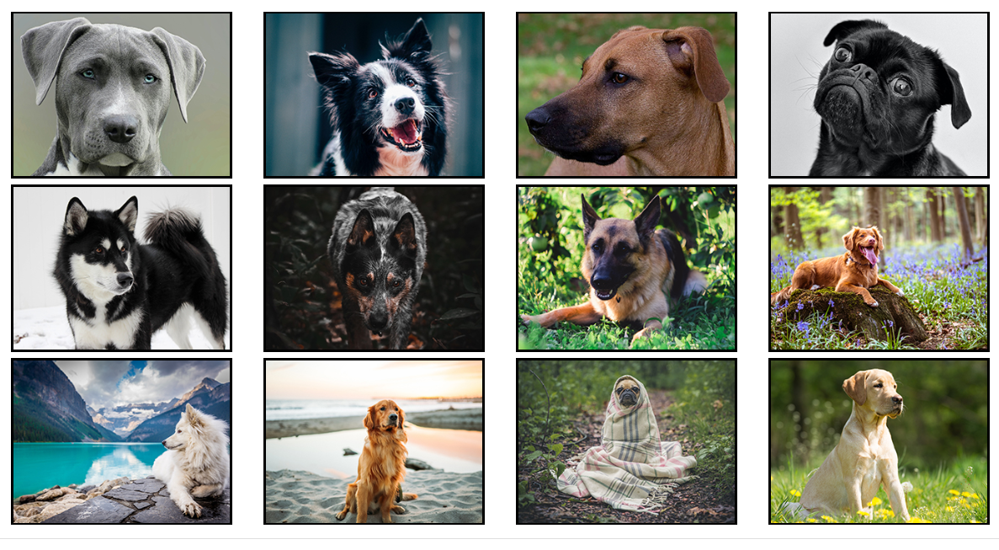

Deployment-
https://phil4lif.github.io/clicky/

This is a memory game built with react.  Each time you click on a card the cards will shuffle.  The goal is to click each dog exactly once.  It is an exercise in state management.  